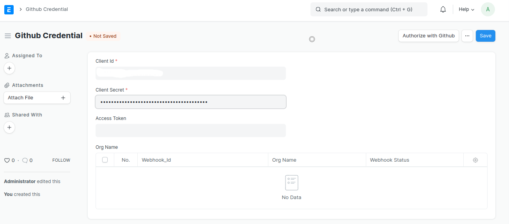
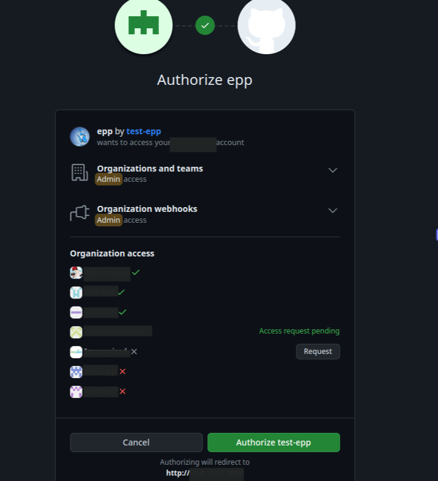
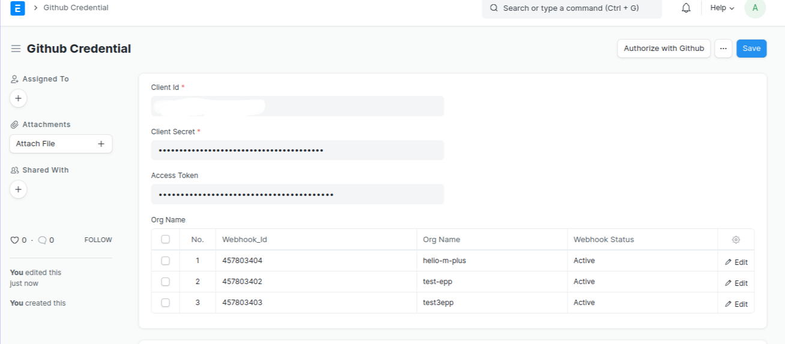
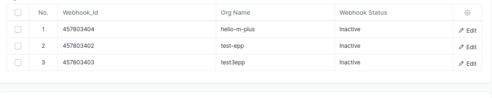
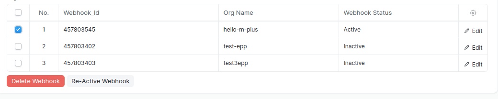
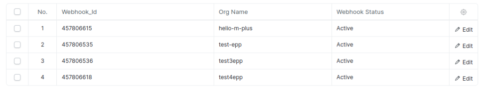

# Introduction

GitHub Credentials is a doctype designed to facilitate the management of OAuth app credentials related to GitHub apps within an organization. Users can add their own credentials such as client ID and secret, which are then utilized for authorization and webhook creation for organizations to which the user has access.

You must see Creating app guidlines for ERPNext-Projects-Plus. [Create-app](../github-credential/create_app.md)

## How to Create a GitHub App

To create a GitHub app, users must be authorized members of the organization with the necessary access rights. Follow the link below for detailed instructions on creating a GitHub app:

[Creating a GitHub App Documentation](https://docs.github.com/en/apps/creating-github-apps/registering-a-github-app/registering-a-github-app)

## How It Works?

1. **Adding Credentials:** Users input their GitHub app credentials, including the client ID and secret, into the GitHub Credentials doctype.

   
   *Github_Credential Doctype where ClientId & secret add*
   

3. **Authentication Process:** The system uses these credentials for authentication and responds with a URL. Users can use this URL to obtain an access token.

4. **Accessing Organizations:** Once the access token is verified and obtained, users can access a list of organizations. They can then send requests to create webhooks for desired organizations.
   
     
   *A page where users can view a list of authorized organizations and request access to create a webhook*
   

5. **Displaying Webhook Status:** After creating webhooks, the GitHub Credentials doctype displays a table listing organizations along with their webhook status (either "Active" or "Inactive").
   
   
   *Webhook Status*

6. **Managing Webhooks:** Users can delete organization webhooks using the "Delete Organization" button. Upon deletion, the webhook status is updated to "Inactive." Additionally, users can reactivate webhooks using the "Re-Activate Webhook" button, updating the status to "Active."
   
   
   *Delete Webhook request sent and then webhook_status display as 'inactive'*

   
   *Re-Active Webhook request sent and then webhook_status is display as 'Active'*

7. **Reauthorization:** The "Authorize with GitHub" button allows users to resend requests to GitHub for creating webhooks, both for organizations with inactive webhooks and newly added ones.

   
   *Authorize webhook request sent and then inactive and newly  added organization added as 'active'*

## Demo

For a visual demonstration of the process, please refer to the following demo video:

    <iframe style="position: absolute; top: 0; left: 0; width: 100%; height: 100%;"  src="./assets/github_cred_demo.webm" frameborder="0" allowfullscreen>
    </iframe>

This documentation provides a comprehensive guide on utilizing GitHub Credentials for managing OAuth app credentials and creating webhooks for GitHub organizations.
